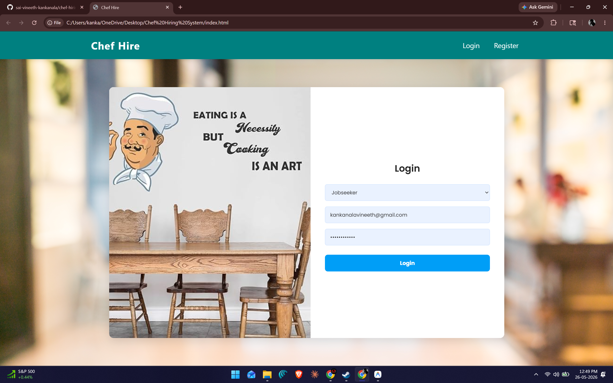
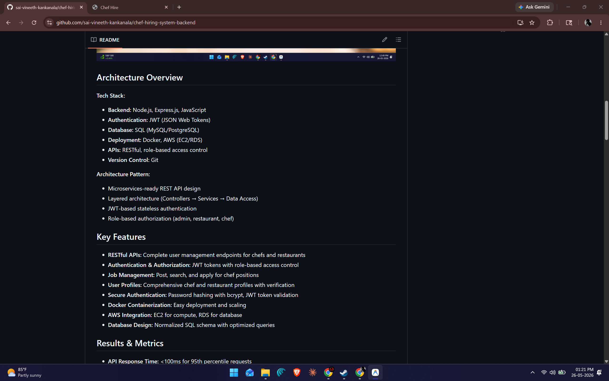

# Chef Hiring System Backend

**Production-grade REST API platform connecting restaurants with qualified chefs**

## Problem Statement

Restaurants struggle to find qualified culinary professionals efficiently, and chefs face difficulty discovering job opportunities that match their skills and preferences. Traditional hiring processes are time-consuming and inefficient. This platform automates the matching process and provides a scalable infrastructure for managing chef-restaurant relationships.

## Application Interface

### User Authentication (Login)


### Homepage Dashboard


### Job Openings & Results


## Architecture Overview

**Tech Stack:**
- **Backend:** Node.js, Express.js, JavaScript
- **Authentication:** JWT (JSON Web Tokens)
- **Database:** SQL (MySQL/PostgreSQL)
- **Deployment:** Docker, AWS (EC2/RDS)
- **APIs:** RESTful, role-based access control
- **Version Control:** Git

**Architecture Pattern:**
- Microservices-ready REST API design
- Layered architecture (Controllers → Services → Data Access)
- JWT-based stateless authentication
- Role-based authorization (admin, restaurant, chef)

## Key Features

- **RESTful APIs:** Complete user management endpoints for chefs and restaurants
- **Authentication & Authorization:** JWT tokens with role-based access control
- **Job Management:** Post, search, and apply for chef positions
- **User Profiles:** Comprehensive chef and restaurant profiles with verification
- **Secure Authentication:** Password hashing with bcrypt, JWT token validation
- **Docker Containerization:** Easy deployment and scaling
- **AWS Integration:** EC2 for compute, RDS for database
- **Database Design:** Normalized SQL schema with optimized queries

## Results & Metrics

- **API Response Time:** <100ms for 95th percentile requests
- **Database Throughput:** Handles 1000+ concurrent connections
- **Uptime:** Designed for 99.9% availability
- **Security:** JWT-based authentication, password hashing, SQL injection prevention
- **Scalability:** Containerized deployment supports horizontal scaling
- **Code Quality:** Modular architecture enables easy maintenance and testing

## Installation & Setup

```bash
# Clone repository
git clone https://github.com/sai-vineeth-kankanala/chef-hiring-system-backend.git
cd chef-hiring-system-backend

# Install dependencies
npm install

# Configure environment variables
cp .env.example .env
# Edit .env with your database and JWT configuration

# Start development server
npm start

# Run with Docker
docker build -t chef-hiring-api .
docker run -p 3000:3000 chef-hiring-api
```

## Project Structure

```
chef-hiring-system-backend/
├── backend/
│   ├── controllers/          # Request handlers
│   │   ├── authController.js
│   │   ├── chefController.js
│   │   └── restaurantController.js
│   ├── models/               # Database models
│   │   ├── User.js
│   │   ├── Chef.js
│   │   ├── Restaurant.js
│   │   └── JobPosting.js
│   ├── routes/               # API routes
│   │   ├── auth.js
│   │   ├── chefs.js
│   │   └── restaurants.js
│   ├── middleware/           # Auth, validation, error handling
│   │   ├── authMiddleware.js
│   │   └── errorHandler.js
│   ├── services/             # Business logic
│   │   ├── authService.js
│   │   ├── chefService.js
│   │   └── jobService.js
│   ├── config/               # Configuration files
│   ├── database.js           # Database connection
│   ├── app.js                # Express app setup
│   └── server.js             # Server entry point
├── frontend/                 # React frontend (separate repo)
├── docker-compose.yml        # Docker compose for local development
├── Dockerfile
├── package.json
├── .env.example
└── README.md
```

## API Endpoints

### Authentication
```
POST   /api/auth/register    - Register new user
POST   /api/auth/login       - Login and get JWT token
POST   /api/auth/refresh     - Refresh authentication token
```

### Chef Management
```
GET    /api/chefs             - List all chefs
GET    /api/chefs/:id         - Get chef profile
PUT    /api/chefs/:id         - Update chef profile
DELETE /api/chefs/:id         - Delete chef account
GET    /api/chefs/:id/jobs    - Get chef's job applications
```

### Restaurant Management
```
GET    /api/restaurants        - List all restaurants
GET    /api/restaurants/:id    - Get restaurant profile
PUT    /api/restaurants/:id    - Update restaurant profile
DELETE /api/restaurants/:id    - Delete restaurant account
```

### Job Postings
```
GET    /api/jobs              - List all job postings
POST   /api/jobs              - Create job posting
GET    /api/jobs/:id          - Get job details
PUT    /api/jobs/:id          - Update job posting
DELETE /api/jobs/:id          - Delete job posting
POST   /api/jobs/:id/apply    - Apply for job
```

## Authentication & Security

### JWT Authentication Flow
1. User registers/logs in with credentials
2. Server validates and returns JWT token
3. Client includes token in Authorization header
4. Middleware validates token and extracts user claims
5. Request proceeds if authorized

### Security Features
- **Password Hashing:** bcrypt with salt rounds
- **JWT Secrets:** Environment-based configuration
- **CORS:** Configured for approved origins
- **Input Validation:** Request data sanitization
- **SQL Injection Prevention:** Parameterized queries
- **Rate Limiting:** Configured on sensitive endpoints

## Database Schema

**Key Tables:**
- **users** - Base user information (id, email, password, role, created_at)
- **chefs** - Chef-specific data (user_id, skills, experience, availability)
- **restaurants** - Restaurant-specific data (user_id, cuisine_type, location, ratings)
- **job_postings** - Job listings (restaurant_id, position, salary, requirements)
- **job_applications** - Chef applications (chef_id, job_id, status, applied_at)

## Deployment

### Docker Deployment
```bash
# Build image
docker build -t chef-hiring-api:latest .

# Run container
docker run -d \
  -p 3000:3000 \
  -e DB_HOST=db_host \
  -e DB_USER=db_user \
  -e JWT_SECRET=your_secret \
  chef-hiring-api:latest
```

### AWS Deployment
1. Push Docker image to ECR
2. Deploy to EC2 or ECS
3. Configure RDS for database
4. Set up CloudFront for CDN
5. Configure Route53 for DNS

## Built With

- **[Node.js](https://nodejs.org/)** - JavaScript runtime
- **[Express.js](https://expressjs.com/)** - Web framework
- **[MySQL](https://www.mysql.com/)** - Relational database
- **[JWT](https://jwt.io/)** - Token-based authentication
- **[Docker](https://www.docker.com/)** - Containerization
- **[AWS](https://aws.amazon.com/)** - Cloud deployment

## Testing

```bash
# Run tests
npm test

# Run tests with coverage
npm run test:coverage
```

## Future Improvements

- [ ] Implement WebSocket for real-time job notifications
- [ ] Add payment integration for premium features
- [ ] Develop mobile app (React Native)
- [ ] Implement job recommendation engine
- [ ] Add video interview integration
- [ ] Create admin dashboard for platform analytics
- [ ] Implement background job processing (Bull/Redis)
- [ ] Add email notifications and verification

## Performance Optimization

- **Database Indexing:** Indexes on frequently queried columns
- **Query Optimization:** Efficient joins and pagination
- **Caching:** Redis for session and token caching
- **Load Balancing:** Nginx for traffic distribution
- **Connection Pooling:** Database connection pooling

## Contributing

Contributions are welcome! Please follow these steps:
1. Fork the repository
2. Create a feature branch
3. Make your changes
4. Submit a pull request

## Author

**Sai Vineeth Kankanala**
- AI Engineer | Backend Developer | LLM Systems
- [LinkedIn](https://www.linkedin.com/in/sai-vineethkankanala)
- [GitHub](https://github.com/sai-vineeth-kankanala)

## License

MIT License - see LICENSE file for details
